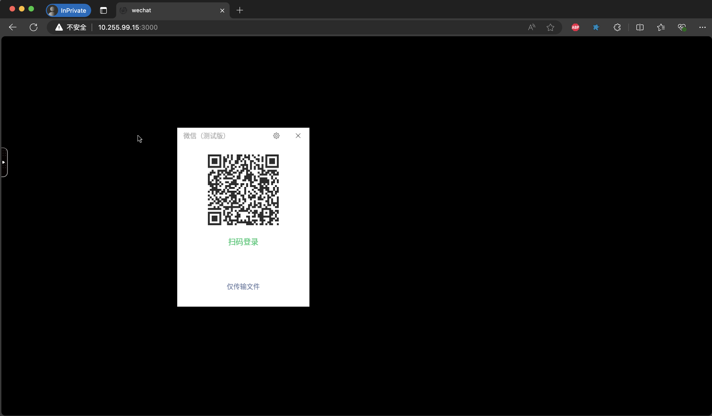

# [sassv/wechat](https://github.com/henry-proj/docker-wechat)
可在网页访问的微信，使用的Linux原生版本微信，基础镜像来自于[LinuxServer.io](https://www.linuxserver.io/)


## 支持的架构
该镜像支持的架构有：
| Architecture | Available | Tag                |
| ------------ | --------- | ------------------ |
| x86-64       | ✅         | amd64-<版本标签>   |
| ARM64        | ❌         | arm64v8-<版本标签> |
| armhf        | ❌         |

## 应用程序设置
该应用程序可以通过以下地址访问：
- https://yourhost:3001/
### 所有基于 Selkies 的 GUI 容器中的选项
该容器基于Docker Baseimage Selkies，这意味着有额外的环境变量和运行配置来启用或禁用特定功能。
#### 可选环境变量
| Variable           | Description                                                                                           |
| ------------------ | ----------------------------------------------------------------------------------------------------- |
| CUSTOM_PORT        | 容器内HTTP监听的端口, 默认为`3000`                                                                    |
| CUSTOM_HTTPS_PORT  | 容器内HTTPS监听的端口, 默认为`3001`                                                                   |
| CUSTOM_WS_PORT     | 容器内WebSockets监听的端口, 默认为`8082`.                                                             |
| CUSTOM_USER        | HTTP基本身份验证用户名, 默认为`abc`。                                                                 |
| PASSWORD           | HTTP基本身份验证密码, 默认为`abc`。如果未设置，则不会进行身份验证                                     |
| DRI_NODE           | 启用VAAPI流编码并使用指定设备, 例如`/dev/dri/renderD128`                                              |
| DRINODE            | 指定使用哪个GPU进行DRI3加速, 例如`/dev/dri/renderD129`                                                |
| SUBFOLDER          | 如果运行子文件夹反向代理，应用程序的子文件夹需要加上两个斜杠。例如: /subfolder/                       |
| TITLE              | 网页浏览器显示的页面标题，默认‘Selkies’                                                               |
| DASHBOARD          | 允许用户设置他们的仪表板。选项： selkies-dashboard, selkies-dashboard-zinc, selkies-dashboard-wish    |
| FILE_MANAGER_PATH  | 修改默认上传/下载文件路径，路径必须对abc用户有适当的权限                                              |
| START_DOCKER       | 如果设置为false，具有特权的容器将不会自动启动 DinD Docker 设置                                        |
| DISABLE_IPV6       | 如果设置为true或任何值，这将禁用 IPv6                                                                 |
| LC_ALL             | 将容器运行的语言设置为例如`fr_FR.UTF-8`,`ar_AE.UTF-8`                                                 |
| NO_DECOR           | 如果设置，应用程序将在没有窗口边框的情况下运行，以用作 PWA。 （可以使用 Ctrl+Shift+d 启用和禁用装饰） |
| NO_FULL            | 使用 openbox 时不要自动全屏应用程序。                                                                 |
| NO_GAMEPAD         | 禁用用户空间游戏手柄插入器注入。                                                                      |
| DISABLE_ZINK       | 如果检测到显卡，请勿设置 Zink 环境变量（用户空间应用程序将使用 CPU 渲染）                             |
| DISABLE_DRI3       | 如果检测到显卡，请勿使用 DRI3 加速（用户空间应用程序将使用 CPU 渲染）                                 |
| MAX_RES            | 为容器传递更大的最大分辨率默认为 16k 15360x8640                                                       |
| WATERMARK_PNG      | 容器内水印png的完整路径例如`/usr/share/selkies/www/icon.png`                                          |
| WATERMARK_LOCATION | 在流媒体上绘制图像的位置,下面的整数选项。1:左上角,2:右上角,3:左下角,4:右下角,5:居中,6:动画            |

## 用法
为了帮助您开始从此映像创建容器，您可以使用 docker-compose 或 docker cli。
### docker-compose(推荐)
```yaml
services:
  wechat:
    image: sassv/wechat:latest
    container_name: wechat
    security_opt:
      - seccomp:unconfined #optional
    environment:
      - PUID=1000
      - PGID=1000
      - TZ=Asia/Shanghai
      - LC_ALL=zh_CN.UTF-8
      - CUSTOM_USER=admin
      - PASSWORD=admin
      - DRINODE=/dev/dri/renderD128
    devices:
      - /dev/dri:/dev/dri
    volumes:
      - /data/docker-data/wechat/data:/config
    ports:
      - 3001:3001
    shm_size: "4gb"
    restart: unless-stopped
    #network_mode: "host"
```
### docker cli
```yaml
docker run -d \
  --name=wechat \
  --security-opt seccomp=unconfined `#optional` \
  -e PUID=1000 \
  -e PGID=1000 \
  -e LC_ALL=zh_CN.UTF-8 \
  -e TZ=Asia/Shanghai \
  -e DRINODE=/dev/dri/renderD128 \
  -e CUSTOM_USER=admin \
  -e PASSWORD=admin \
  -p 3001:3001 \
  -v /data/docker-data/wechat/data:/config \
  --device /dev/dri:/dev/dri \
  --shm-size="4gb" \
  --restart unless-stopped \
  sassv/wechat:latest
```
## 参数
容器是通过在运行时传递的参数（如上述所示）进行配置的。这些参数用冒号分隔，并分别表示`< external >:< internal >`。例如，`-p 8080:80` 将使容器内的80端口可以从容器外部的主机 IP 的8080端口上进行访问。
| Parameter                         | Function                                                                                                                        |
| --------------------------------- | ------------------------------------------------------------------------------------------------------------------------------- |
| -p 3001                           | HTTPS 微信桌面界面。                                                                                                            |
| -e PUID=1000                      | 用于在容器中配置用户的 UID（用户标识符）                                                                                        |
| -e PGID=1000                      | 用于在容器中运行进程的用户组 ID（Group ID）                                                                                     |
| -e TZ=Asia/Shanghai               | 指定要使用的时区                                                                                                                |
| -v /config                        | 容器中的用户主目录，存储本地文件和设置                                                                                          |
| --shm-size=                       | 设置容器的共享内存大小（/dev/shm 的大小）。                                                                                     |
| --security-opt seccomp=unconfined | 仅对于 Docker 引擎，许多现代 GUI 应用程序需要它在旧主机上运行，​​因为 Docker 不知道系统调用。没有它微信就以无沙箱测试模式运行。 |
## 通过域名访问
### Nginx配置
```conf
server {
    listen 80;
    listen [::]:80;
    listen 443 ssl;
    listen [::]:443 ssl;
    server_name wechat.example.com;

    ssl_certificate /etc/nginx/ssl/example.com/example.com.crt;
    ssl_certificate_key /etc/nginx/ssl/example.com/example.com.key;

    if ($scheme != "https") {
        return 301 https://$host$request_uri;
    }

    location / {
        # WebSocket Support
        proxy_set_header        Upgrade $http_upgrade;
        proxy_set_header        Connection "upgrade";

        # Host and X headers
        proxy_set_header        Host $host;
        proxy_set_header        X-Real-IP $remote_addr;
        proxy_set_header        X-Forwarded-For $proxy_add_x_forwarded_for;
        proxy_set_header        X-Forwarded-Proto $scheme;

        add_header 'Cross-Origin-Embedder-Policy' 'require-corp';
        add_header 'Cross-Origin-Opener-Policy' 'same-origin';
        add_header 'Cross-Origin-Resource-Policy' 'same-site';

        # Connectivity Options
        proxy_http_version      1.1;
        proxy_read_timeout      1800s;
        proxy_send_timeout      1800s;
        proxy_connect_timeout   1800s;
        proxy_buffering         off;
        proxy_pass https://127.0.0.1:3001;
    }
}
```


